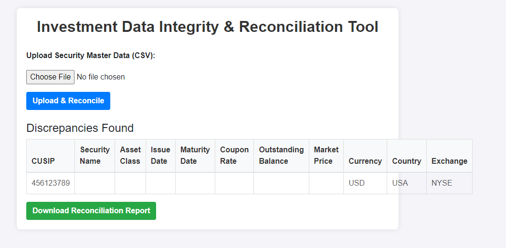
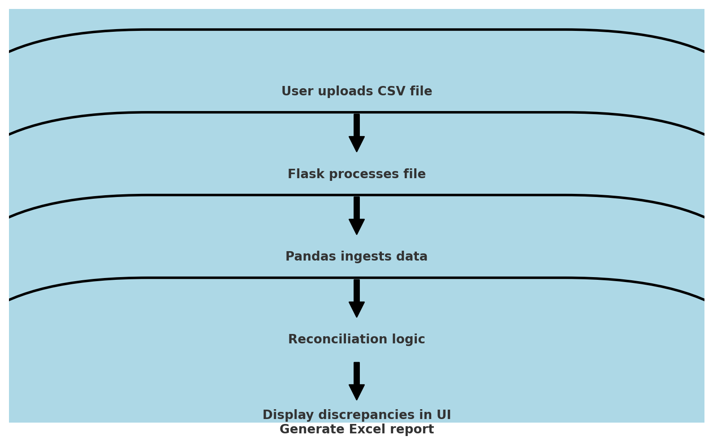

# Investment Data Integrity and-Reconciliation Tool with Flask UI like Mendix
This project simulates a data integrity and reconciliation process for investment portfolios, leveraging security master data from multiple sources (e.g., Bloomberg, ICE) to detect and resolve discrepancies. The project automates the reconciliation process, provides data integrity reports, and suggests improvements for managing data accuracy. 

## Project Overview

This project is a web-based tool developed using Python, Flask, and Bootstrap. It allows users to upload security master data (in CSV format) from different sources, reconcile them to find discrepancies, and generate downloadable reports in Excel format. The UI is simple and easy to use, offering features similar to a Mendix-like UI, making it ideal for investment data management.

## Features

- Upload security master data files (CSV)
- Automated reconciliation of uploaded data to find discrepancies
- Display discrepancies in the web UI
- Download a detailed reconciliation report (Excel)
- Built using Flask, Pandas, Bootstrap for a responsive UI, and custom CSS styling

## Technologies Used

- Python
- Flask
- Pandas
- Bootstrap
- HTML/CSS
- Excel for report generation

## Project Structure

```bash
flask_ui_project/
├── app.py              # Main Flask application
├── templates/
│   └── index.html      # Main UI template (HTML with Bootstrap)
├── static/
│   └── style.css       # Custom CSS styling
├── uploads/            # Folder for storing uploaded CSV files
├── reports/            # Folder for storing generated reports
├── reconciliation.py   # Python script for reconciliation logic
├── README.md           # Project documentation (this file)
```

## Installation and Setup

1. **Clone the repository:**
   ```bash
   git clone https://github.com/JUnelus/Investment-Data-Integrity-and-Reconciliation-Tool-with-a-Simple-Flask-UI-like-Mendix.git
   ```

2. **Create a virtual environment (optional but recommended):**
   ```bash
   python -m venv venv
   source venv/bin/activate  # On Windows use `venv\Scripts\activate`
   ```

3. **Install the required dependencies:**
   ```bash
   pip install -r requirements.txt
   ```

4. **Run the Flask application:**
   ```bash
   python app.py
   ```

5. **Access the application:**
   Open your web browser and go to `http://127.0.0.1:5000` to use the tool.


## Usage

1. Upload a security master CSV file.
2. The tool will automatically reconcile the data and display any discrepancies found.
3. You can also download a reconciliation report in Excel format for further analysis.

## Example CSV Structure

Here is an example of how the CSV file should be structured for security master data:

```csv
CUSIP,Security Name,Asset Class,Issue Date,Maturity Date,Coupon Rate,Outstanding Balance,Market Price,Currency,Country,Exchange
123456789,ABC Corp Bond,Bond,2020-01-01,2030-01-01,3.50%,1000000,100.50,USD,USA,NYSE
987654321,XYZ Corp Stock,Equity,2019-05-15,N/A,N/A,N/A,150.75,USD,USA,NASDAQ
456123789,DEF Mortgage Backed,MBS,2021-03-01,2035-03-01,4.00%,500000,98.75,USD,USA,NYSE
654789123,GHI Treasury Bond,Bond,2018-07-01,2028-07-01,2.00%,250000,102.25,USD,USA,NYSE
```
